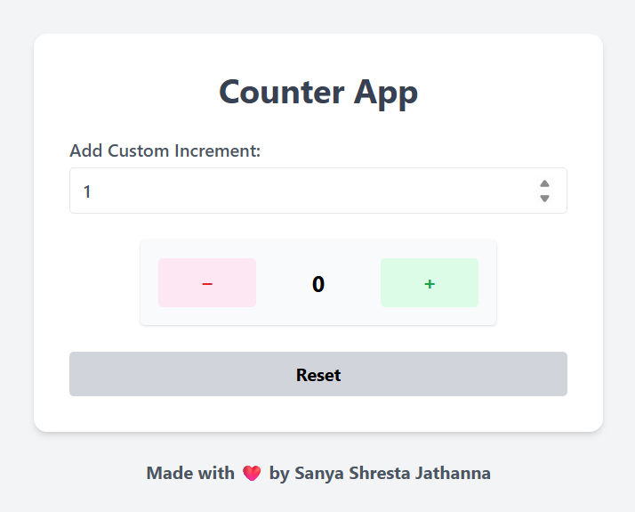

# 🔢 Counter App

An interactive and responsive counter app built with **React + TypeScript** and **Tailwind CSS**. This project demonstrates the fundamentals of React's `useState` and event handling with a clean UI and fully responsive layout.

---

## 🚀 Live Demo

* 🌐 **Live Site URL**: [View it in action](https://counter-app-steel-pi.vercel.app/)
* 💻 **Source Code**: [GitHub Repository](https://github.com/SanyaShresta25/Counter-App)

---

## 📸 Screenshot



---

## 🧱 Built With

* ⚛️ **React** (with TypeScript) – Leveraging hooks and functional components
* 💨 **Tailwind CSS** – Utility-first CSS framework for responsive styling
* 📱 **Mobile-First Design** – Fully responsive on all screen sizes

---

## ✨ Features

* 🔢 **Current Count Display** – Starts from `0` and updates dynamically
* ➕ **Increment Button** – Increases the count by a custom value
* ➖ **Decrement Button** – Decreases the count (never below `0`)
* 🔁 **Reset Button** – Resets the counter to `0`
* 🔧 **Custom Increment Input** – User-defined increment value (default is `1`)

---

## 🧠 What I Learned

* Mastered **`useState`** for state management in React
* Built accessible, reusable UI components using **TypeScript**
* Handled input events and validated numeric user input
* Applied **conditional rendering** and dynamic Tailwind classes
* Practiced **responsive design** using Tailwind breakpoints

---

## 🔧 Getting Started

```bash
# Clone the repository
git clone https://github.com/SanyaShresta25/Counter-App.git
cd Counter-App

# Install dependencies
npm install

# Run the development server
npm run dev
```

---

## 📚 Topics Covered

* `useState` Hook
* Event Handling in React
* Input Handling with Validation
* TypeScript Basics in React
* Responsive Design with Tailwind

---

## 📌 Future Enhancements

* Add theme toggle (light/dark mode)
* Keyboard accessibility improvements
* Save history of counts
* Add animation for transitions

---

## 📚 Useful Resources

* [React Docs – useState](https://react.dev/reference/react/useState)
* [Tailwind CSS Docs](https://tailwindcss.com/docs)
* [React TypeScript Cheatsheet](https://react-typescript-cheatsheet.netlify.app/)

---

## 👩‍💻 Author

* **Portfolio** – [Sanya Shresta Jathanna](https://sanyashresta.netlify.app/)
* **GitHub** – [@SanyaShresta25](https://github.com/SanyaShresta25)
* **LinkedIn** – [Sanya Shresta Jathanna](https://www.linkedin.com/in/sanya-shresta-jathanna)

---

## 🙌 Acknowledgments

* Inspired by everyday tasks where counters are used – from score tracking to timers.
* Thanks to the React and Tailwind community for making frontend development joyful.

---
